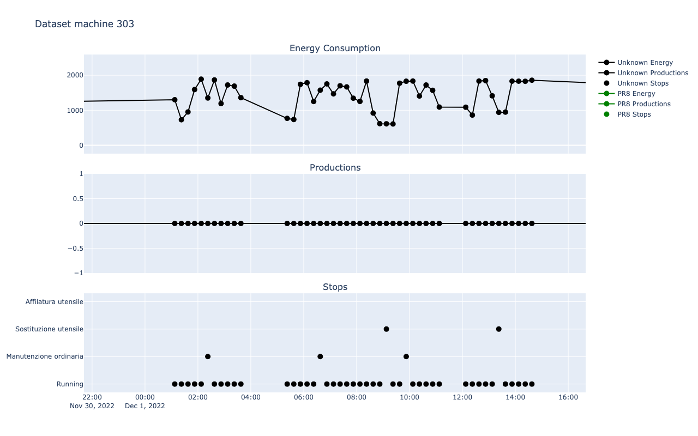
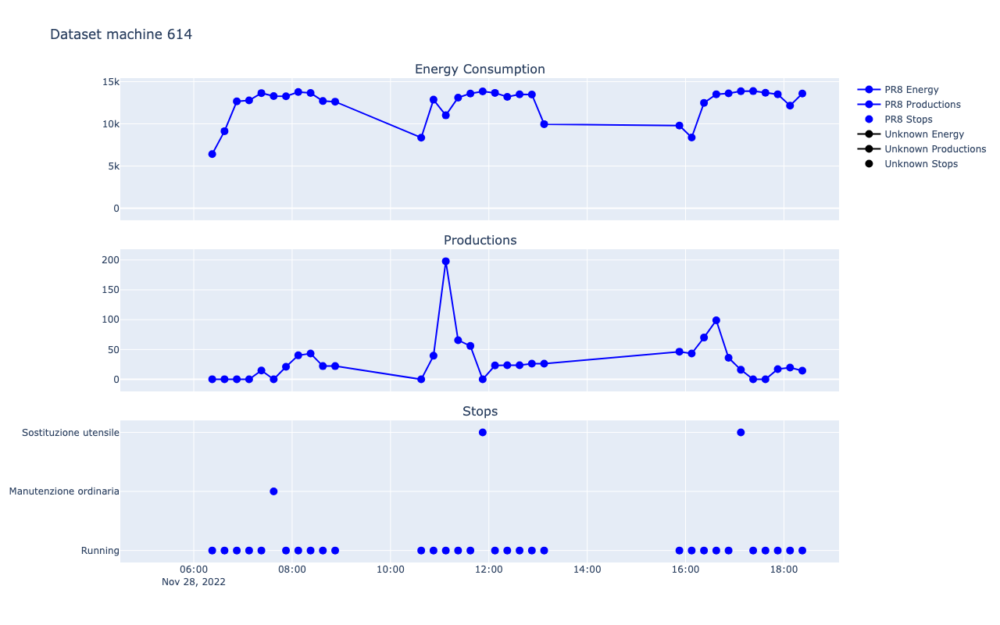

# BigData-iot-project

This project is about data analysis, a machine generates data A, B, and C the data analyzed, then it is stored in a database, and finally visualized.

<!-- 1. [BigData-iot-project](#bigdata-iot-project) -->
### Table of Contents
1. [Requirements](#requirements)
   - [Versions and installs](#versions-and-installs)
   - [Download Dataset](#download-dataset)
2. [Dataset](#dataset)
   - [Dataset analysis](#dataset-analysis)
   - [Feasibility analysis](#feasibility-analysis)
3. [Machine Learning](#machine-learning)
   - [Linear Model](#linear-model)
   - [Classification Model](#classification-model)
   - [Spark and MLlib](#spark-and-mllib)


# Requirements
## Versions and installs
- Python 3.11.6
- pip 24.0

```bash
pip install -r requirements.txt
```

## Download Dataset
Download the zip folder [Dataset](https://unicamit-my.sharepoint.com/:u:/g/personal/dtmassimo_callisto_unicam_it/Ea_sngfV6UtGmQmpqW_IzLMBmHu72S3buS-znskjszUimw?e=dNORZx), extract and put into the `dataset` folder in the root of the project.

# Dataset
The dataset is formed by

- Energy Consumption, small files in the form of energy/location*Tormatic_channel*{id}...csv
- Productions, a big files in the form of energy/Tomatic*{date}*...csv
- Stops, a big files in the form of fermi/FERMATE\ YYMM.csv - The names are made of YY (year) and MM (month)
  We firstly need to merge those files into a single file for each channel and date

## Data cleaning
The data is not clean, as the timestamps are not consistent, so we need to clean the data to merge them.
- Energy consumptions are saved every 15 minutes
- Productions are saved in unpredictable timestamps
- Stops are saved when the machine stops, so the timestamp is unpredictable

The first objective is to convert every data into a single timestamp format. So I choose to convert Productions and Stops every 15 minutes
- Productions
   1. First I calculate the time interval between start and end (example: 20 minutes)
   2. I divide the productions by the time interval (minutes) to have the mean production for each minute. (example: 40/20=2 productions per minute)
   3. I duplicate the same row for each minute. (example: 20 rows with 2 productions each and the same timestamp)
   4. I use cumcount() function to transform a dataset from [2,4,5] to [1,2,1,2,3,4,1,2,3,4,5], this allow me to understand how many minutes to add to each row of the timestamp
   5. I add the increasing number of minutes to the timestamp
   6. I group and sum the productions for each 15 minutes
- Stops, it is similar to the productions but here we don't have to deal with summing the data as we choose to simply duplicate the rows for each 15 minutes that are in the timestamp. Example: if we have a stop from 10:05 to 10:50, I will duplicate the same row for 3 times
   1. First I calculate the time interval between start and end (example: 45 minutes)
   2. I compute how many quarters are in the time interval (example: 45/15=3)
   3. I duplicate the same row for each quarter. (example: 3 rows with the same timestamp)
   4. I use cumcount() function to understand how many quarters to add to each row of the timestamp (example: [2] to [0,1,2])
   5. I transform the rows to the 15 minutes previous to the stop (example: 10:05 to 10:00, 10:20 to 10:15, 10:35 to 10:30)
   6. I add the increasing number of quarters to the timestamp multiplied by 15 (example: [10:00,10:00,10:00] to [10:00,10:15,10:30])


## Dataset analysis
The analysis is made using the Jupyter Notebook and pandas library
- First of all, I need to merge the dataset into a single file
  - To do this I have to clean the dataset to prepare the merge, problems like different timestamps and different formats do not allow the data to be merged
- Then I used a visual library named Plotly to visually show the data to think on the possible analysis

Possible relations are
- The production problems could be related to the voltage spikes or drops
- Problems/productions rate

## Feasibility analysis
We have a milion of rows, it seems that we have enough data to make a machine learning model, but we need to check if the data is correlated.
First of all i merged the months of the same machine to have a wider view of the lifecycle of a single machine, this allows me to better understand if a machine have enough data to be suitable for ML, some results are:
- Machine 110, the data shows inconsistency on the stops, as sometime increases with productions and EC, sometimes decreases
- Machine 301, at the beginning the stops do not changes the productions, then the stops follows EC, then it shows consistency and inconsistency unpredictably
- Machine 302, sometimes the stops increases with the productions, sometimes decreases
- Machine 306, may be interesting, in the second half, the EC sometimes is related to the stops, sometimes to the productions
- Machine 313, if the first half the Stops leads to a decrease in EC and Productions, while on the second half this is not true 
- Machine 315, sometimes the stops increases with the productions and EC, sometimes decreases
- Machine 319, sometimes the stops increases with the productions and EC, sometimes decreases
- Machine 515, sometimes the stops increases with the productions and EC, sometimes decreases
- Machine 610, sometimes the stops increases with the productions and EC, sometimes decreases
- Etc.

Now some graphical examples are


As we can see some machines shows a higher correlation (machines 301 and 302) between energy consumption and productions, while others didn't show any correlation at all

We can also show what happens near the stops



In the latter we can see that we have an increase of productions before the stop

# Machine Learning

## Linear Model
I trained a linear model to predict how many stops we will have in the next hour, using 80% of the data and test using the remaining 20%. The result is an average Mean Square Error of 1.5

## Classification Model
Then I tried to use a classification algorithm to predict if and when we will have a failure, the results are much better as the average percentage of accuracy is 0.55 and for some machines it reaches 0.75

## Spark and MLlib
At the end I implemented a spark application to do a MLlib task using a Gradient Boosted Tree Classifier and the results are really good, with an accuracy of 92%, but it can only predict if we have a stop or not, not the type of stop.
