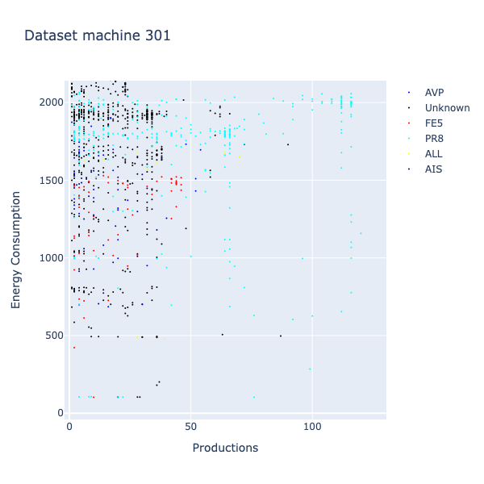
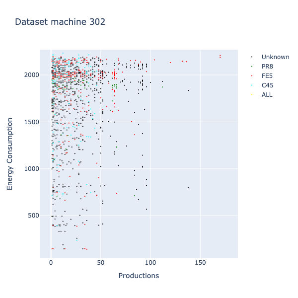
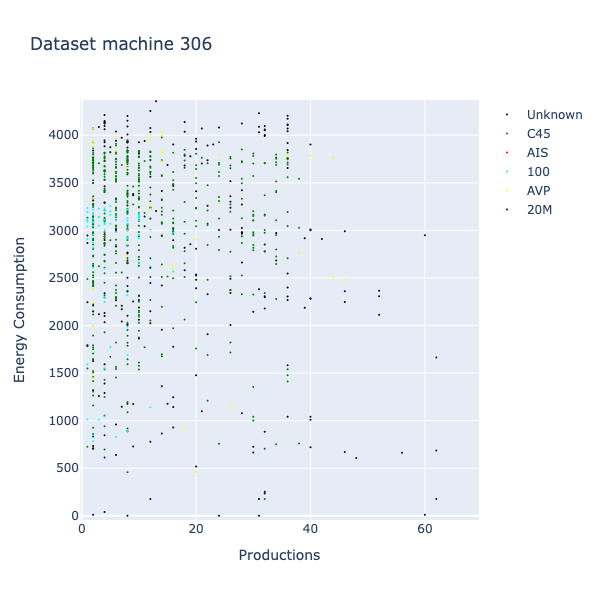
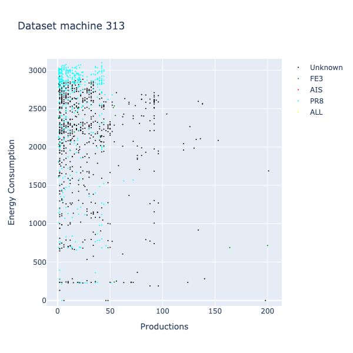
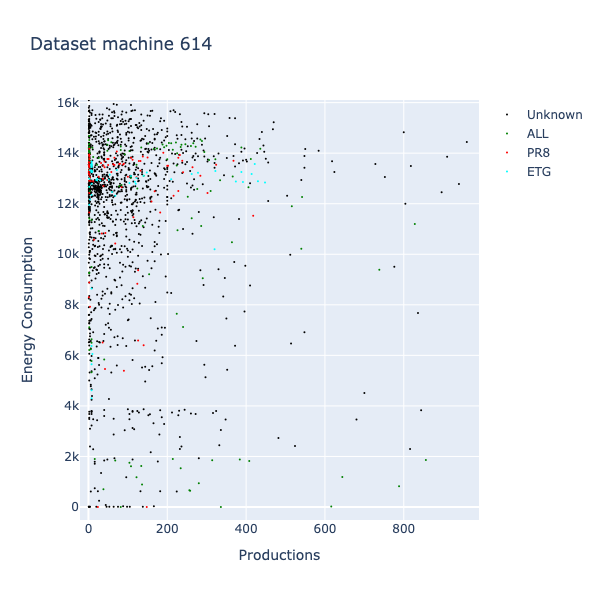

# BigData-iot-project

This project is about data analysis, a machine generates data A, B, and C the data analyzed, then it is stored in a database, and finally visualized.

## Dataset

The dataset is formed by

- Energy Consumption, small files in the form of energy/location*Tormatic_channel*{id}...csv
- Productions, a big files in the form of energy/Tomatic*{date}*...csv
- Stops, a big files in the form of fermi/FERMATE\ YYMM.csv - The names are made of YY (year) and MM (month)
  We firstly need to merge those files into a single file for each channel and date

## Dataset analysis

The analysis is made using the Jupyter Notebook and pandas library
- First of all, I need to merge the dataset into a single file
  - To do this I have to clean the dataset to prepare the merge, problems like different timestamps and different formats do not allow the data to be merged
- Then I used a visual library named Plotly to visually show the data to think on the possible analysis

Possible relations are
- The production problems could be related to the voltage spikes or drops
- Problems/productions rate

# Feasibility analysis
We have a milion of rows, it seems that we have enough data to make a machine learning model, but we need to check if the data is correlated.
First of all i merged the months of the same machine to have a wider view of the lifecycle of a single machine, this allows me to better understand if a machine have enough data to be suitable for ML, some results are:
- Machine 110, the data shows inconsistency on the stops, as sometime increases with productions and EC, sometimes decreases
- Machine 301, at the beginning the stops do not changes the productions, then the stops follows EC, then it shows consistency and inconsistency unpredictably
- Machine 302, sometimes the stops increases with the productions, sometimes decreases
- Machine 306, may be interesting, in the second half, the EC sometimes is related to the stops, sometimes to the productions
- Machine 313, if the first half the Stops leads to a decrease in EC and Productions, while on the second half this is not true 
- Machine 315, sometimes the stops increases with the productions and EC, sometimes decreases
- Machine 319, sometimes the stops increases with the productions and EC, sometimes decreases
- Machine 515, sometimes the stops increases with the productions and EC, sometimes decreases
- Machine 610, sometimes the stops increases with the productions and EC, sometimes decreases
- ...

Now some graphical examples are

As we can see some machines shows a higher correlation (machine 302) between energy consumption and productions, while others didn't show any correlation at all

# Machine Learning

## Linear Model
I trained a linear model to predict how many stops we will have in the next hour, using 80% of the data and test using the remaining 20%. The result is an average Mean Square Error of 1.5

## Classification Model
Then I tried to use a classification algorithm to predict if and when we will have a failure, the results are much better as the average percentage of accuracy is 0.55 and for some machines it reaches 0.75

## Spark and MLlib
At the end I implemented a spark application to do a MLlib task using a Gradient Boosted Tree Classifier and the results are really good, with an accuracy of 92%, but it can only predict if we have a stop or not, not the type of stop.
